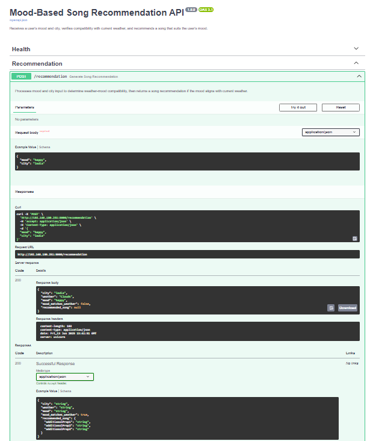

# 🎵 Mood-Based Song Recommendation API

A modern backend API that recommends music based on a user's current **mood** and **weather conditions** in their city. Built using **FastAPI**, this project integrates the **OpenWeatherMap** and **Last.fm** APIs to deliver personalized song suggestions.

---

## 🚀 Key Features

- 🔍 Accepts user input for mood and city
- 🌤️ Retrieves current weather using OpenWeatherMap API
- 💡 Matches mood with weather conditions
- 🎶 Recommends songs via Last.fm based on mood
- 📦 Clean, modular, and production-ready codebase
- 📈 Fully testable with included unit tests
- 🔧 Easy configuration with `.env` file support

---

## 🧰 Tech Stack

- Python 3.9+
- FastAPI
- Uvicorn (ASGI server)
- OpenWeatherMap API
- Last.fm API
- Requests
- python-dotenv
- Pytest

---

## 📁 Project Structure

```
mood_song_api/
│
├── app/
│   ├── weather.py             # Weather API integration
│   ├── music.py               # Last.fm music fetch logic
│   ├── mood_matcher.py        # Mood-weather matching rules
│   ├── utils.py               # Text normalization, helpers
│   └── schemas.py             # Pydantic request/response models
│
├── main.py                    # FastAPI application entrypoint
├── .env                       # Environment config (API keys)
├── README.md                  # Project documentation
├── requirements.txt           # Dependencies list
└── tests/
    └── test_main.py           # Unit test suite
```

---

## 🧪 Local Development Setup

1. **Clone and set up environment**

```bash
   python -m venv venv
   source venv/bin/activate  # On Windows: venv\Scripts\activate
   pip install -r requirements.txt
```

2. **Configure API keys**

Create a `.env` file in the root directory and add your API keys:

```
OPENWEATHER_API_KEY=your_openweathermap_api_key
LASTFM_API_KEY=your_lastfm_api_key
```

3. **Run the server**

```bash
   uvicorn main:app --reload
```

Visit `http://127.0.0.1:8000/docs` for interactive API documentation (Swagger UI).

---

## 🔗 API Endpoints

### `GET /ping`
Health check endpoint  
✅ Returns: `{"status": "ok"}`

---

### `POST /recommendation`

Takes mood and city, returns a mood-weather matched song.

**Request Body:**

```json
{
  "mood": "happy",
  "city": "Bangalore"
}
```

**Sample Successful Response:**

```json
{
  "city": "Bangalore",
  "weather": "Clear",
  "mood": "happy",
  "mood_matches_weather": true,
  "recommended_song": {
    "title": "Happy",
    "artist": "Pharrell Williams"
  }
}
```

---

## 🖼️ Screenshots

### 🏠 App Home Screen


### 🤷‍♀️ Result Screen


### ⚙️ Settings Screen


### 🧪 Test Output


### 🌐 Swagger UI (API Documentation)


---

---

## 🧪 Running Tests

Run the test suite with:

```bash
   pytest
```

All core functions are covered, including API responses and logic validation.

---

## ✅ Features

- Integrates with OpenWeatherMap for live weather.
- Fetches top tracks from Last.fm.
- Smart matching of mood to weather.
- Well-tested with positive and negative scenarios.


